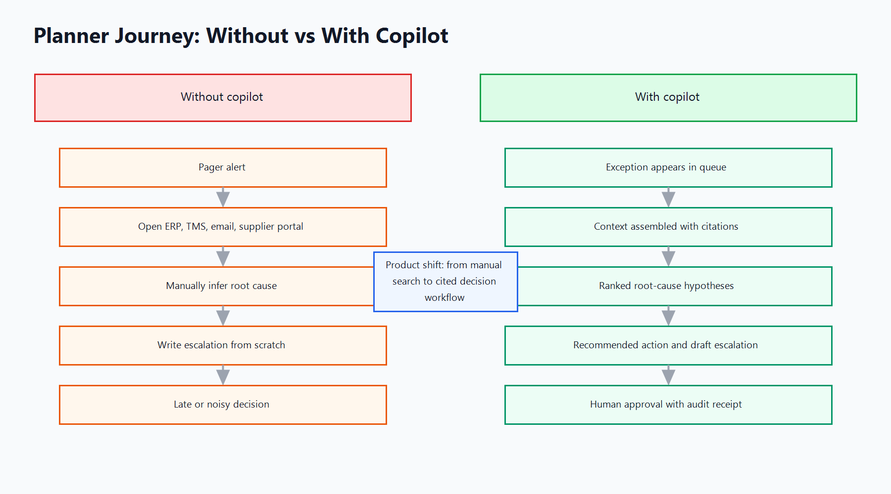

# 02 - Users And Workflows

The product serves three operators who see the same exception through different
time horizons. The planner owns today's service risk. The sourcing lead owns
supplier leverage and commercial tradeoffs. The ops director owns customer
commitments and cross-functional escalation. The copilot must respect those
differences instead of producing one generic answer.

## Priya, supply chain planner

Priya owns a family of high-runner assemblies and is measured on service level,
shortage aging, and on-time recovery. Her trigger is an exception event: a
purchase order is five days late, a projected stockout appears inside lead time,
or transportation status no longer supports the production schedule.

Current journey:

1. Open ERP shortage and purchase order screens.
2. Check TMS milestone status and carrier notes.
3. Search email and chat for supplier commitments.
4. Compare current shortage to prior exceptions for the same part family.
5. Decide whether to wait, expedite, substitute, split order, or escalate.
6. Write a status note for the morning standup and update the tracker manually.

Pain points: Priya has high event volume and low time per event. She needs a
ranked view of what changed, not another dashboard. Her core question is "what
is the next reversible action that protects the SLA?" The copilot-assisted
journey starts from the exception queue, not a blank prompt. The copilot shows a
triage summary, likely root-cause hypotheses, cited evidence, missing context,
and two or three bounded actions. Priya approves a draft supplier email or
rejects the recommendation with a reason code. The rejection becomes training
data for future evals.

| Current state | Copilot-assisted state |
| --- | --- |
| Priya searches system by system. | Copilot assembles ERP, TMS, supplier, contract, and prior-resolution context. |
| Priya writes the same summary repeatedly. | Copilot drafts a cited exception brief. |
| Escalation depends on memory and gut. | Escalation is based on SLA risk, supplier history, customer impact, and confidence. |

## Marcus, sourcing lead

Marcus owns supplier performance, commercial terms, and corrective-action
leverage. His trigger is not every late line; it is a pattern: repeated misses
from a constrained supplier, a premium-freight dispute, or an exception that may
require enforcing contract terms.

Current journey:

1. Receive a planner escalation with partial context.
2. Pull supplier scorecard, contract, lead-time commitments, and open NCRs.
3. Ask the planner for missing order and shipment details.
4. Decide whether to pressure the supplier, approve alternate sourcing, or
   preserve the relationship for a larger negotiation.
5. Send supplier-facing communication and document the outcome.

Pain points: Marcus is penalized when escalations arrive late, but also when
planners escalate noise. He needs a narrative that separates supplier fault from
internal forecast change, logistics delay, or demand pull-in. The
copilot-assisted journey gives Marcus a supplier view: exception clusters,
commercial exposure, contractual obligations, and recommended negotiation
posture. It should not tell him to "demand recovery" unless the evidence says
the supplier missed a committed date within its control.

| Current state | Copilot-assisted state |
| --- | --- |
| Escalations arrive as incomplete emails. | Escalations include cited facts, missing evidence, and recommended posture. |
| Supplier accountability is argued manually. | Contract clauses and historical performance are retrieved into the workflow. |
| Corrective actions are tracked outside the exception loop. | Supplier follow-up and planner outcomes feed the learning loop. |

## Dana, ops director

Dana owns customer-facing commitments and executive escalation. Her trigger is a
high-impact exception: a top customer shipment is at risk, a line-down scenario
is possible, or the recovery option requires a material margin tradeoff.

Current journey:

1. Get a red status in the daily operations review.
2. Ask planning, sourcing, logistics, and finance for their version of the
   issue.
3. Compare service risk against cost of expedite, alternate buy, or demand
   reprioritization.
4. Decide whether to notify sales, adjust customer commitment, approve premium
   cost, or escalate to leadership.
5. Request an after-action review if the miss becomes visible.

Pain points: Dana is usually late to the details and early to the consequences.
She needs a decision brief with confidence, options, risk, and auditability. The
copilot-assisted journey produces an escalation packet: current state, likely
root cause, customer impact, action options, cost/time tradeoffs, unresolved
questions, and a decision log. Dana can approve a premium action or send the
case back because evidence is insufficient.

| Current state | Copilot-assisted state |
| --- | --- |
| Dana reconciles conflicting narratives live. | Dana receives a cited, role-specific decision brief. |
| Cost and service tradeoffs are reconstructed manually. | Tradeoffs are shown with assumptions and source links. |
| After-action learning is inconsistent. | Override reasons and final outcomes are attached to the original recommendation. |

The design implication is clear: the copilot must be workflow-native and
role-aware. Priya needs speed and reversible next actions. Marcus needs supplier
truth and commercial context. Dana needs a crisp decision packet. The same
underlying data should support all three, but the product surface must answer
the job each user is actually doing.
