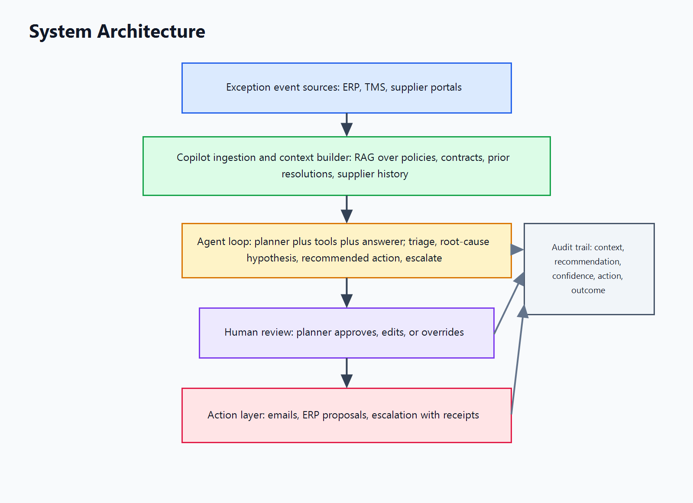

# 05 - System Architecture

The architecture is intentionally read-heavy until a human approves an action.
The LLM lives in the agent loop, where it can plan analysis, call retrieval and
calculation tools, draft explanations, and format recommendations. It does not
live in the action layer. The action layer is deterministic workflow code with
approval tokens, policy checks, audit logging, and integration-specific guards.
That separation is the central trust boundary.

## Exception event sources

Sources include ERP shortages, purchase order changes, production schedule
misses, TMS milestone changes, supplier portal updates, quality holds, and
customer-commitment trackers. Their responsibility is to emit structured facts:
part, supplier, order, site, promised date, need date, quantity, lane, customer
impact, and current status. Inputs are transactional system events and scheduled
polls. Outputs are normalized exception records with source identifiers and
timestamps. Technology choices should favor existing enterprise integration
paths: event streams where available, batch connectors where necessary, and
idempotent polling for legacy portals. The trust boundary is data provenance.
The copilot can read these events and cite them, but it cannot alter the source
record at intake.

## Copilot ingestion and context builder

The ingestion layer converts exception records into a retrieval plan. It pulls
from policies, supplier contracts, past resolution logs, supplier scorecards,
material master data, inventory position, open purchase orders, freight status,
quality records, and approved playbooks. Retrieval scope is deliberately
bounded. The copilot can see records relevant to the part, supplier, lane,
site, customer commitment, and user's permission set. It cannot see unrelated
supplier contracts, pricing data outside the user's access, HR data, or private
communications that have not been approved for operational use. Inputs are the
normalized exception and the current user's identity. Outputs are ranked context
bundles with source links, snippets, freshness, permissions, and retrieval
confidence. Technology choices include hybrid search, vector retrieval over
approved documents, keyword filters for identifiers, and deterministic joins for
structured records. The trust boundary is access control plus citation.

## Agent loop: planner, tools, answerer

The agent loop performs triage, root-cause hypothesis generation, recommended
action selection, and escalation drafting. The planner subcomponent decides what
information is needed. Tools retrieve context, calculate time-to-stockout,
compare alternate suppliers, estimate premium freight exposure, and check
policy constraints. The answerer produces the cited summary and recommendation.
Inputs are the context bundle, tool results, and user role. Outputs are a
triage brief, ranked hypotheses, action options, confidence labels, missing
data, and draft communications. The LLM belongs here because this is where
ambiguous evidence needs narrative synthesis. It should not be allowed to call
external write APIs directly. The trust boundary is recommendation versus
execution: the model can propose, explain, and draft, but it cannot commit.

## Human review

Human review is the approval gate. Priya may approve a supplier email draft,
Marcus may approve a commercial escalation, and Dana may approve premium cost
or customer communication. Inputs are the copilot output, citations, confidence,
and missing-context warnings. Outputs are approval, override, rejection, or
request for more context. Technology choices should make this a workflow screen,
not a chat transcript: clear action buttons, reason codes, diff view for edited
drafts, and an audit sidebar. The trust boundary is explicit accountability.
Every consequential action must be tied to a named approver, timestamp, and
versioned recommendation. Human edits should be captured because they reveal
where the copilot was useful and where it failed.

## Action layer

The action layer executes approved side effects: sending emails, staging or
committing ERP updates, opening supplier corrective-action requests, updating
exception status, or sending leadership escalation packets. It receives only
approved, structured action requests. It validates policy, checks permissions,
records receipts, and writes to downstream systems. This layer should be
deterministic and testable. The LLM should not be embedded here because action
execution must be reproducible, auditable, and constrained by policy. The action
surface is narrow: read APIs are broad, proposal APIs can prepare staged
changes, and write APIs require approval tokens. For alpha, ERP writes should
remain proposals only. Direct commit can be considered after the system proves
low false-confidence rates and strong audit controls.

## Audit trail

Every recommendation is logged with the exception input, retrieved context,
model prompt template version, model output, tool calls, confidence, user
decision, final action, and outcome. This audit trail is not a compliance
afterthought. It is the foundation for evals, incident review, supplier dispute
resolution, and product improvement. If a recommendation was wrong, the team
should be able to tell whether retrieval missed evidence, the model ignored
evidence, the user overrode correctly, or the action layer executed the wrong
approved request. A copilot without this audit trail is just a faster way to
produce uninspectable operational risk.
