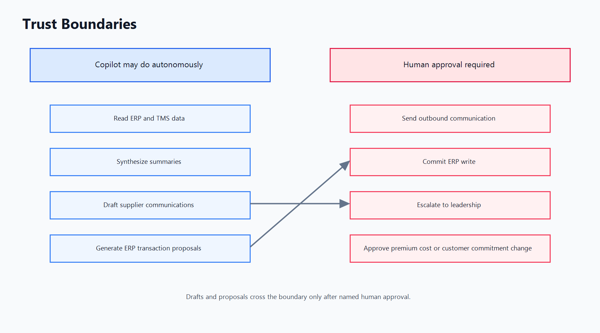

# 06 - Eval And Trust Model

The copilot should be evaluated like a decision-support system, not like a
general assistant. A fluent answer is insufficient. The system must retrieve the
right evidence, reason from it faithfully, recommend an action a senior planner
would accept, and refuse when evidence is missing. The eval program should use a
held-out exception set that includes late supplier shipments, transportation
delays, quality holds, forecast pull-ins, customer escalation risk, and
ambiguous multi-cause cases.

## Retrieval quality

Retrieval quality is measured with recall@k and mean reciprocal rank on labeled
exception cases. For each case, subject-matter experts mark the documents or
records needed to make a safe recommendation: purchase order, supplier promise,
contract clause, TMS milestone, material inventory, customer commitment, and
prior exception. A P0 threshold should require recall@10 of at least 0.90 for
critical evidence and MRR high enough that the most important evidence appears
near the top of the context bundle. Retrieval misses are severity-ranked. A
missed email with minor color is low severity. A missed contract clause that
changes expedite ownership is high severity. The system should not hide this
distinction behind a single aggregate score.

## Citation faithfulness

Citation faithfulness measures whether generated claims are grounded in
retrieved context. The metric is the percent of claims that are both cited and
supported by the cited source. The eval harness should sample claims about
dates, quantities, supplier commitments, customer impact, cost, contract terms,
and policy constraints. A recommendation that says "supplier missed the promise
date" must cite the promise date and the actual milestone. If the cited source
only says a shipment is delayed, the claim is too strong. The target before beta
should be at least 95 percent citation faithfulness on high-impact claims, with
manual review of failures.

## Action-recommendation accuracy

Action-recommendation accuracy is the percent of copilot recommendations that a
senior planner agrees are appropriate given the evidence available at the time.
This is not the same as final outcome accuracy. A recommendation can be
reasonable and still fail because a supplier misses a later promise. The eval
should ask senior planners to rate the action as correct, acceptable with edits,
too aggressive, too passive, or unsafe. The product target is not 100 percent
automation. A strong beta target is 70 percent correct, 20 percent acceptable
with edits, and less than 2 percent unsafe in the benchmark set.

## False-confidence rate

False-confidence rate is the percent of high-confidence answers that are wrong
or unsupported. This is the most important safety metric because planners are
more likely to trust confident outputs under time pressure. The product should
track high-confidence wrong answers separately for retrieval misses, reasoning
errors, stale data, permission gaps, and policy ambiguity. Launch rollback is
triggered if false-confidence rate exceeds 5 percent in production review, or if
any single false-confident recommendation creates supplier relationship damage.

## Autonomy boundaries

The copilot is allowed to autonomously read ERP and TMS data, synthesize
summaries, draft supplier communications, generate ERP transaction proposals,
rank exceptions, retrieve policy context, and ask for missing information. These
are reversible or inspectable actions. The copilot is not allowed to send
outbound communication, commit an ERP write, approve premium cost, change
customer commitments, or escalate to leadership without human approval. Any
outbound communication, ERP write, supplier corrective-action request,
leadership escalation, or customer-impact statement requires a named approver.

## Refusal behavior

Low-confidence behavior is a product feature. When the copilot lacks enough
context, it must say so plainly: "I do not have enough context to recommend an
action." It should then list the missing evidence, such as the latest supplier
promise, the governing contract clause, current inventory at the consuming site,
or customer escalation threshold. It may propose a safe next step to gather that
evidence, but it should not invent a root cause. Refusal quality should be
evaluated with adversarial cases where key evidence is deliberately withheld.

## Production monitoring

Production evals should combine automated checks and human review. Automated
checks include uncited-claim detection, retrieval coverage, action-gate
enforcement, latency, and permission violations. Human review samples closed
exceptions weekly and asks whether the copilot helped, hurt, or merely
summarized. The strongest signal is not model applause. It is whether planners
resolve exceptions faster without increasing overrides, false escalations, or
relationship damage.
