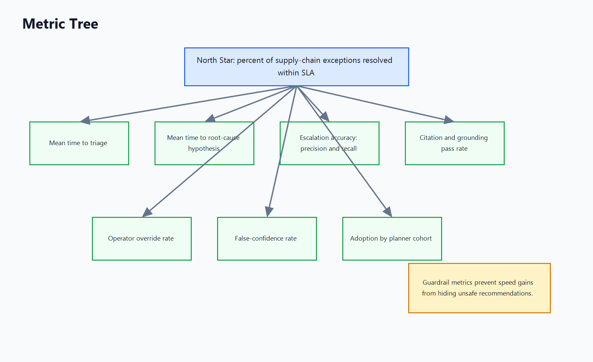

# 07 - Metrics And Launch Plan



The north-star metric is the percent of supply-chain exceptions resolved within
SLA. This is the right top-level measure because the product exists to improve
operational recovery, not to increase chat volume or produce more summaries.
The metric must be defined by exception class. A supplier delay with seven days
to customer commitment should not be compared naively with a same-day line-down
risk. Each exception needs a start time, SLA deadline, closure criteria, and
outcome code. Closure means the operational risk has a documented decision and
the agreed action has a receipt, not merely that someone changed a tracker
status to green.

The metric tree is:

```text
North Star: percent of supply-chain exceptions resolved within SLA

Input metrics:
  - Mean time to triage
  - Mean time to root-cause hypothesis
  - Escalation accuracy, precision and recall
  - Citation and grounding pass rate
  - Operator override rate
  - False-confidence rate
  - Adoption by planner cohort
```

Mean time to triage measures how long it takes from exception creation to a
usable first decision brief. This should fall quickly if the product is working.
Mean time to root-cause hypothesis measures the diagnostic burden. Escalation
accuracy is split into precision and recall: precision asks whether escalated
cases really required attention, while recall asks whether the copilot caught
the cases that should have been escalated. Citation and grounding pass rate is a
quality guardrail. Operator override rate is a usefulness and calibration
signal. A low override rate with high false confidence is dangerous, while a
high override rate means the product is not fitting planner judgment. Adoption
by planner cohort should be measured as active use on real exceptions, not
logins.

## Alpha

Alpha runs for four weeks with one supplier, one planner team, one product
family, and read-only production context. The copilot can draft supplier
communications and ERP proposals, but all writes remain outside the system or
behind manual approval. Success criteria are 50 percent reduction in triage time
for covered exceptions, at least 80 percent planner satisfaction in weekly
survey, zero permission violations, zero auto-send incidents, and no more than 5
percent false-confidence rate in reviewed outputs. The alpha should include
daily review with planners because early failure modes will be practical:
missing documents, bad source freshness, poor queue ranking, and overlong
summaries.

## Beta

Beta runs for eight weeks across regions and adds more suppliers, at least two
transportation lanes, and multiple exception classes. The success criterion is a
10 percent lift in the north-star metric for covered exceptions versus a
matched-control baseline. Additional beta gates are citation faithfulness above
95 percent on high-impact claims, override rate below 35 percent, and recall of
high-severity escalations above 90 percent. Beta should test change management:
planner onboarding, sourcing-lead review, ops-director escalation packets, and
handoffs across time zones.

## General availability

GA expands org-wide only after the product proves value without weakening trust.
Success criteria are 20 percent lift in the north-star metric, override rate
below 25 percent, false-confidence rate below 3 percent in weekly review, and no
critical supplier-data leakage incidents. GA can add deeper ERP proposal
coverage, but direct commits should remain gated until the organization has
confidence in audit controls and operational ownership.

## Rollback criteria

Rollback is triggered if false-confidence rate exceeds 5 percent, override rate
exceeds 50 percent for two consecutive weeks, permission tests fail in
production, or any single supplier-relationship damage incident occurs. A
rollback should degrade to read-only summaries and historical search, not remove
access to already-approved audit records. The product must be designed so that
turning off recommendations does not erase the operational memory created during
launch.
